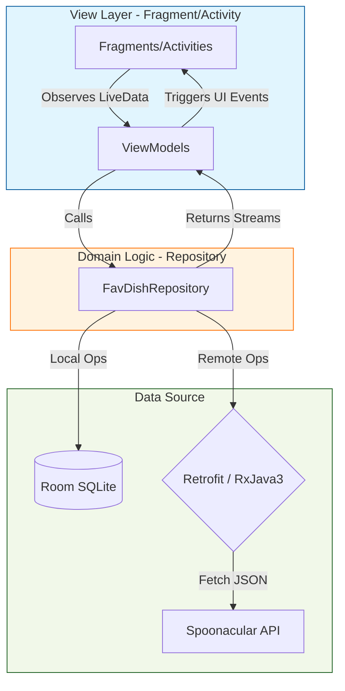
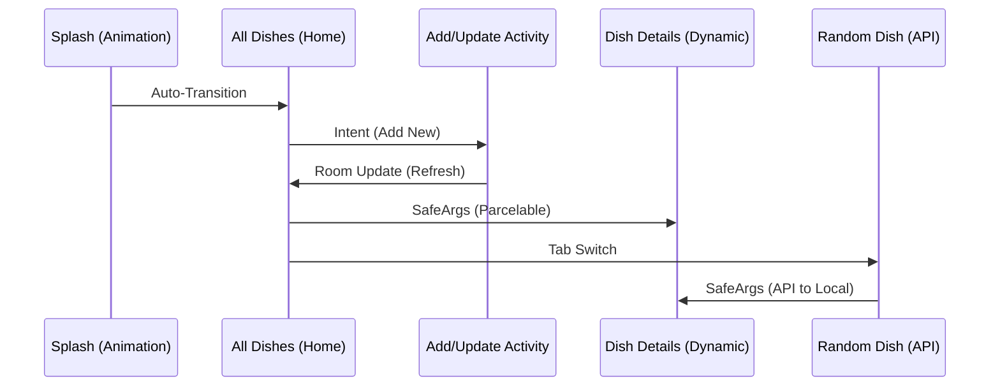

<h1 align="center">🍲 FavoriteDish: A High-Performance Recipe Ecosystem Built with Modern Android Engineering 🚀</h1>

<p align="center">
  <a href="https://kotlinlang.org/"></a>
  <a href="https://developer.android.com/"></a>
  <a href="https://developer.android.com/topic/architecture"></a>
  <a href="https://developer.android.com/training/data-storage/room"></a>
  <a href="https://square.github.io/retrofit/"></a>
  <a href="https://github.com/ReactiveX/RxJava"></a>
</p>

---

## 📑 Table of Contents
- [🎯 Executive Summary](#-executive-summary)
- [🏗️ High-Level Architecture](#️-high-level-architecture)
- [🚀 Feature Deep-Dive](#-feature-deep-dive)
- [🛠️ Detailed Technical Stack](#️-detailed-technical-stack)
- [📊 MAD Score (Modern Android Development)](#-mad-score-modern-android-development)
- [📡 Network & Data Flow](#-network--data-flow)
- [🎨 UI/UX Design System](#-uiux-design-system)
- [🔔 Background Services](#-background-services)
- [📸 Visual Showcase](#-visual-showcase)
- [⚙️ Engineering Setup](#️-engineering-setup)
- [📈 Learning Trajectory](#-learning-trajectory)

---

## 🎯 Executive Summary
**FavDish** is not just an app; it is a comprehensive technical demonstration of **Modern Android Development (MAD)**. Built as a high-tier personal education project, it solves the "What should I cook today?" problem by blending local recipe management with global API-driven discovery. 

The project was engineered to showcase mastery over the entire Android lifecycle, from complex UI animations and dynamic color processing to robust background task scheduling and reactive data streams.

---

## 📸 Visual Showcase

<p align="center">
  
  
  
</p>
<p align="center">
  
  
  
</p>
<p align="center">
  
  
  
</p>
<p align="center">
  
  
  
</p>
<p align="center">
  
  
  
</p>
<p align="center">
  
  
  
</p>
<p align="center">
  
  
  
</p>
---


---

## 🏗️ High-Level Architecture

### 🏛️ Model-View-ViewModel (MVVM) + Repository Pattern
FavDish implements a strict separation of concerns. The **Repository** acts as the mediator between the **Local Room Database** and the **Remote Retrofit Service**, ensuring a "Single Source of Truth."



### 🛣️ Navigation Component Flow
The application utilizes a single-activity architecture with **Jetpack Navigation**.



---

## 🚀 Feature Deep-Dive

### 💾 1. Local Recipe Management (The Personal Cookbook)
- **Persistence:** High-performance local storage using **Room DB**.
- **CRUD Operations:** Full Create, Read, Update, and Delete capabilities with reactive UI updates.
- **Image Persistence:** Efficiently saves captured or selected images to internal storage, storing paths in SQLite to minimize DB size.

### 🎲 2. Global Recipe Discovery (The Explorer)
- **API Integration:** Connects to the **Spoonacular Global API**.
- **RxJava3 Single:** Handles network requests as Single observables, ensuring a non-blocking UI thread.
- **Swipe-to-Discover:** Implements `SwipeRefreshLayout` for a modern, tactile interaction to pull new recipes.

### 🎨 3. Dynamic Visual Engine
- **Palette API:** The "Dish Details" screen extracts the dominant color from the recipe's image and applies it to the background dynamically.
- **Glide Transformations:** Professional-grade image loading with caching, center-cropping, and error handling.
- **SDP/SSP:** Uses Scalable DP and Scalable SP libraries to ensure the UI looks consistent across thousands of different Android device resolutions.

### 🔔 4. Engagement & Background Tasks
- **WorkManager:** Schedules `PeriodicWorkRequest` to engage users with notifications even when the app is killed.
- **Intelligent Constraints:** Tasks only run when the battery is not low, optimizing device longevity.

---

## 🛠️ Detailed Technical Stack

### **Core Language & Foundation**
- **Kotlin 2.1.0:** Utilizing Coroutines, Flow, Parcelize, and extension functions.
- **Android KTX:** Leveraging Kotlin extensions for concise, idiomatic code.

### **Jetpack Components**
- **Navigation:** SafeArgs implementation for type-safe data passing.
- **Room:** SQLite abstraction with Flow support for real-time DB observing.
- **ViewModel:** Managing UI-related data in a lifecycle-conscious way.
- **WorkManager:** For guaranteed background execution.

### **Networking & Threading**
- **Retrofit 2.9.0:** Type-safe HTTP client.
- **RxJava3:** Reactive programming for complex asynchronous streams.
- **Gson:** JSON serialization/deserialization.

### **UI & Permissions**
- **Material 3:** Modern design components and themes.
- **ViewBinding & DataBinding:** Eliminating `findViewById` and connecting data directly to layouts.
- **Dexter:** Simplified runtime permission handling (Camera/Gallery).
- **Palette:** Dynamic UI coloring based on image analysis.

---

## 📊 MAD Score (Modern Android Development)

| Criteria | Implementation Status | Tech Used |
| :--- | :---: | :--- |
| **Language** | 🟢 **100% Kotlin** | Coroutines, Flow, Sealed Classes |
| **Architecture** | 🟢 **Excellent** | MVVM + Repository + Clean Code |
| **UI** | 🟢 **Modern** | Material 3, ViewBinding, Palette |
| **Navigation** | 🟢 **Jetpack** | Navigation Component + SafeArgs |
| **Networking** | 🟢 **Reactive** | Retrofit + RxJava3 |
| **Database** | 🟢 **Reactive** | Room + TypeConverters |
| **Background** | 🟢 **Robust** | WorkManager (Periodic) |

---

## 📡 Network & Data Flow

### **The "Random Dish" Lifecycle**
1. **Trigger:** User opens the "Random Dish" tab or swipes to refresh.
2. **ViewModel:** Calls the `RandomDishApiService`.
3. **Retrofit:** Executes the `GET` request with API Key and tags.
4. **RxJava3:** Emits a `Single<RandomDish.Recipes>` stream.
5. **ViewModel:** Subscribes on a background thread, observes on the Main thread.
6. **UI:** Updates via `LiveData` observation, displaying the recipe and downloading the image via **Glide**.

---

## 🎨 UI/UX Design System

### **Responsive Layouts**
By integrating **SDP (Scalable DP)** and **SSP (Scalable SP)**, FavDish achieves a "Build Once, Run Anywhere" UI. Whether on a small pixel phone or a large tablet, the proportions remain perfect.

### **Dynamic Theming**
```kotlin
// Example of the Palette API in action within DishDetailsFragment
Palette.from(bitmap).generate { palette ->
    val intColor = palette?.vibrantSwatch?.rgb ?: 0
    mBinding.rlDishDetailMain.setBackgroundColor(intColor)
}
```

---

## ⚙️ Engineering Setup

### **Prerequisites**
- Android Studio **Ladybug** or higher.
- Gradle **8.13** or higher.
- Minimum SDK: **21** (Lollipop).
- Target SDK: **35** (Android 15).

### **Installation Steps**
1. **Clone the project:**
   ```bash
   git clone https://github.com/yourusername/FavDish.git
   ```
2. **Obtain API Key:**
   - Sign up at [Spoonacular Food API](https://spoonacular.com/food-api).
   - Navigate to `com.myapp.favdish.utils.Constants`.
   - Replace `API_KEY_VALUE` with your unique key.
3. **Sync & Run:**
   - Let Gradle download dependencies.
   - Run the `:app` module on your device.

---

## 📈 Learning Trajectory
Developing **FavDish** was a deep-dive into the complexities of the Android ecosystem. Key technical milestones achieved:
- **Asynchronous Mastery:** Transitioning from basic callbacks to Coroutines and RxJava.
- **State Management:** Learning how to handle configuration changes (rotation) without data loss using ViewModels.
- **Data Integrity:** Designing complex SQLite schemas and handling migrations with Room.
- **Modern UI:** Implementing Material 3 principles and dynamic color extraction.

---
<p align="center"><b>Built with Precision & Passion 🚀</b></p>
